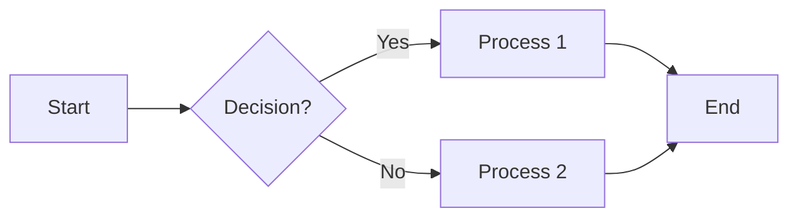

# My Awesome Presentation

## Slide 1: Introduction

Welcome to my presentation! This script handles:

*   Headings
*   Paragraphs
*   Images
*   Mermaid Diagrams
*   Tables
*   Code Blocks

## Slide 2: Images

Let's insert an image from a relative path:


Now, let's try a base64 encoded image.  You'll need to replace the placeholder text with a real base64 string.  You can use an online converter to get this.


## Slide 3: Mermaid Diagram

Here's a Mermaid diagram to visualize a simple process:



## Slide 4: Table Data

A simple table example:

| Header 1 | Header 2 | Header 3 |
|---|---|---|
| Row 1, Cell 1 | Row 1, Cell 2 | Row 1, Cell 3 |
| Row 2, Cell 1 | Row 2, Cell 2 | Row 2, Cell 3 |
| Row 3, Cell 1 | Row 3, Cell 2 | Row 3, Cell 3 |

## Slide 5: Code Example

This is a Python code block:

```python
def greet(name):
    """Greets the person passed in as a parameter."""
    print(f"Hello, {name}!")

greet("World")
```

## Slide 6: Conclusion

Thank you for watching!
